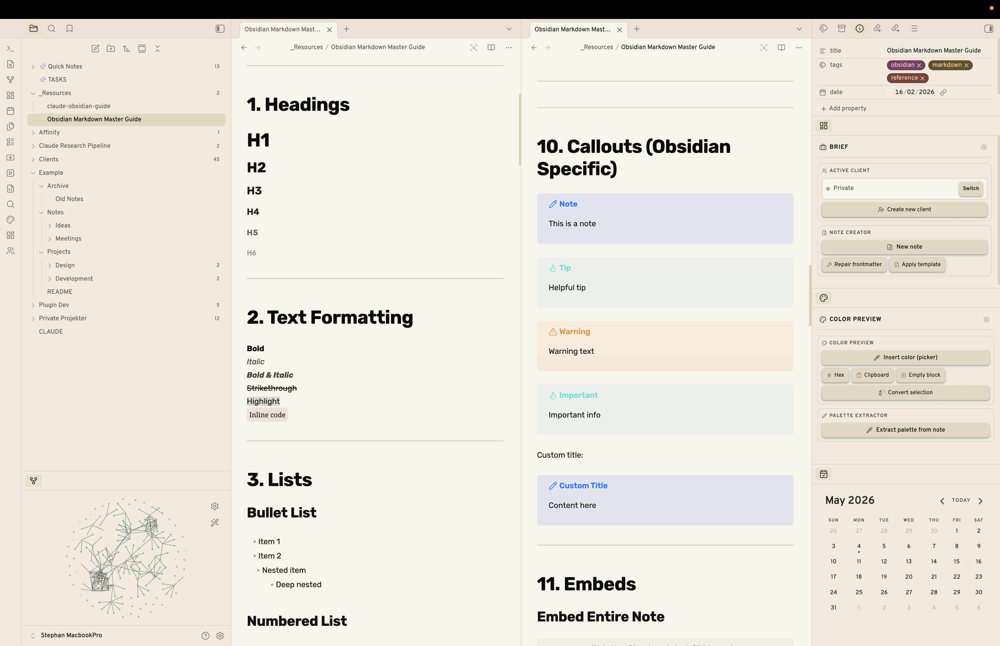
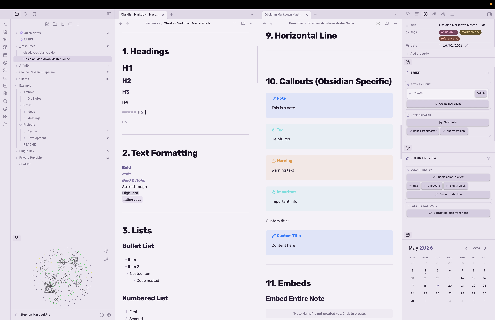
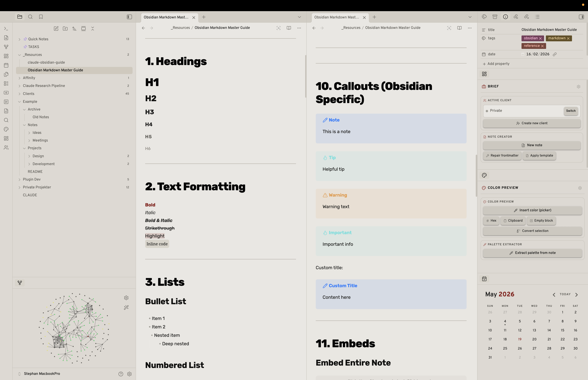
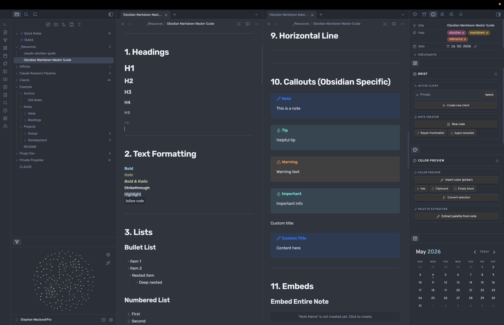
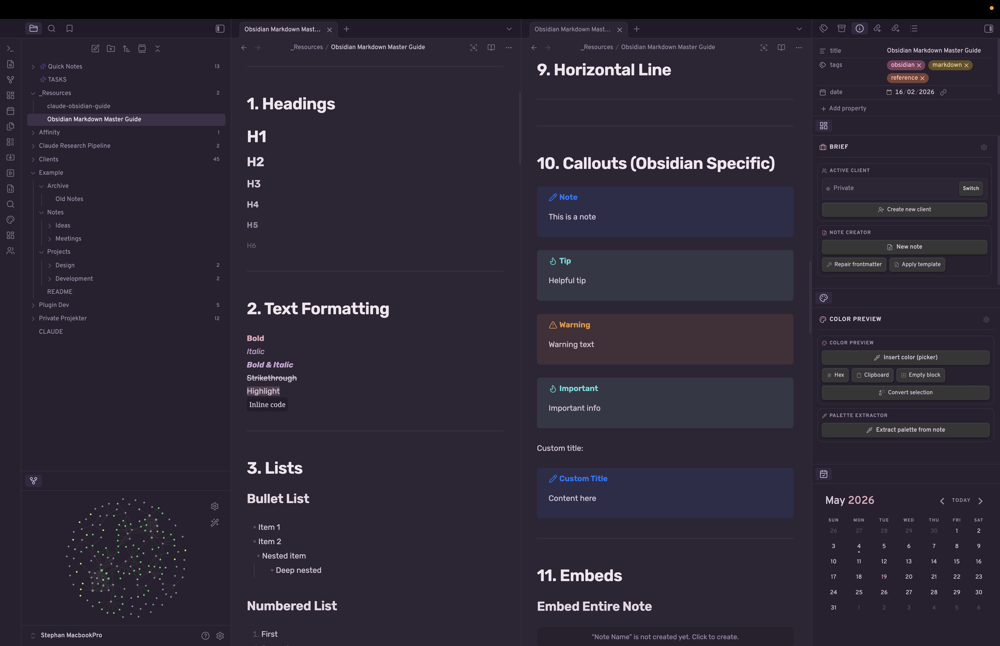
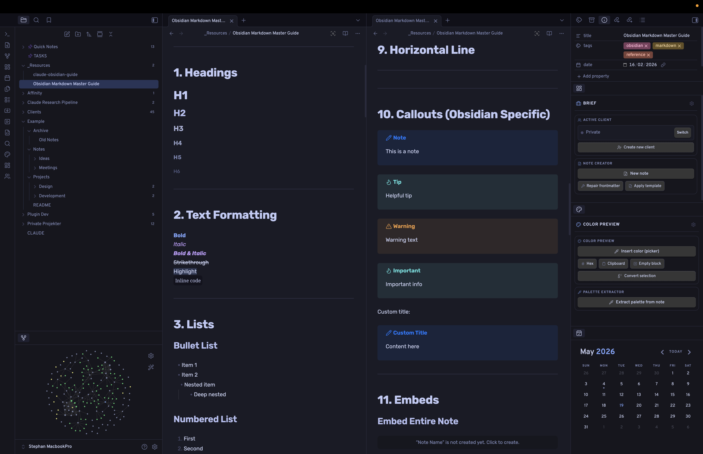

# Lumen

A collection of six refined color schemes for Obsidian — three light, three dark. Each scheme has its own personality while sharing a consistent foundation: clean sans-serif typography, gradient underline links, strong heading hierarchy, and accent-tinted blockquotes.

---

## Color Schemes

### Paper & Ink — Light
Warm off-white with near-black ink. Minimal and print-inspired.

---

### Lavender Fog — Light
Desaturated purple-white with deep plum and soft violet accents.

---

### Iron Press — Light
Newsprint grey with a single crimson accent. Editorial and structured.

---

### Nordic Slate — Dark
Desaturated blue-grey with ice-blue accents. Calm and clean.

---

### Soft Dusk — Dark
Mauve-purple with dusty rose and lavender. Warm and editorial.

---

### Tokyo Night — Dark
Deep indigo with electric blue and violet syntax. Developer-focused.

---

## Features

- **Six distinct color schemes** — three light, three dark, all switchable from a single setting
- **Strong heading hierarchy** — six levels with explicit size, weight, and color at every step; H5 styled as a small-caps section label
- **Gradient underline links** — internal and external links reveal a color underline on hover
- **Accent-tinted blockquotes** — left border with a subtle background fill matching each scheme's accent
- **Styled bold and italic** — each scheme colors `**bold**` and `*italic*` independently for emphasis that reads clearly
- **Tag pills** — rounded, accent-tinted tags with smooth hover transitions
- **Fade-in status bar** — opacity 45% at rest, full on hover, keeping the UI uncluttered
- **Slim scrollbars** — 5px rounded thumbs throughout

---

## Requirements

**[Style Settings](https://github.com/mgmeyers/obsidian-style-settings) is required** to switch between color schemes. Without it, the theme defaults to dark mode.

> If you want to use a light scheme (Paper & Ink, Lavender Fog, or Iron Press), go to **Settings → Style Settings → Lumen → Color scheme** and select it there. The theme itself does not follow Obsidian's light/dark toggle — all switching is done through Style Settings.

---

## Installation

### From the Community Themes browser
1. Open **Settings → Appearance → Themes**
2. Search for **Lumen**
3. Click **Install and use**

### Manual
1. Download `theme.css` and `manifest.json`
2. Create a folder called `Lumen` in `.obsidian/themes/`
3. Place both files inside it
4. Go to **Settings → Appearance** and select **Lumen**

---

## Switching schemes

1. Install the [Style Settings](https://github.com/mgmeyers/obsidian-style-settings) plugin
2. Open **Settings → Style Settings → Lumen**
3. Choose a color scheme from the **Color scheme** dropdown

---

## Author

Made by [Stephan Teig](https://github.com/stephanteig)
